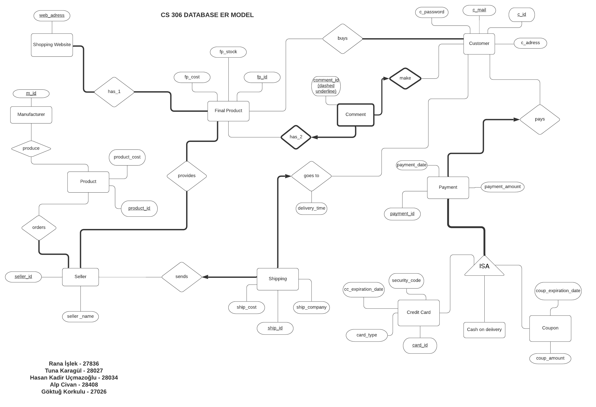

# Online Shopping Database (OSDB)

## Project Description
The purpose of this project is to create an online shopping site, which is a type of electronic commerce that allows customers to buy goods or services directly from a seller via the Internet using a web browser or a mobile application. The site will store the user's address, email address, and phone number. The main advantages of this system are as follows:
- Customers can view the remaining stock and price of a product directly.
- Customers can make purchases using their registered credit cards on the site.
- Sellers can manage stock numbers and product prices easily.
- Sellers only need to deliver the product to the shipping company using the shipment number provided by the site.

## Entities and Attributes

### Shopping Website
- `web_address` - Address of the shopping website.

### Final Product
- `fp_cost` - Cost of the product.
- `fp_id` - Unique identifier for the product.
- `fp_stock` - Stock quantity of the product.

### Customer
- `c_password` - Password of the customer.
- `c_mail` - Email address of the customer.
- `c_id` - Unique identifier for the customer.
- `c_address` - Address of the customer.

### Seller
- `seller_id` - Unique identifier for the seller.
- `seller_name` - Name of the seller.

### Shipping
- `ship_cost` - Cost of shipping.
- `ship_id` - Unique identifier for the shipment.
- `ship_company` - Shipping company responsible for delivering the product.

### Payment
- `payment_date` - Date of the payment.
- `payment_amount` - Total amount of the payment.
- `payment_id` - Unique identifier for the payment.

### Credit Card
- `card_type` - Type of credit card.
- `cc_expiration_date` - Expiration date of the credit card.
- `security_code` - Security code of the credit card.
- `card_id` - Unique identifier for the credit card.

### Manufacturer
- `m_id` - Unique identifier for the manufacturer.

### Product
- `product_cost` - Cost of the product.
- `product_id` - Unique identifier for the product.

### Relationships

- Manufacturer produces product.
- Seller buys product.
- Shop website has product.
- Customer enters shopping website.
- Customer buys product.
- Customer pays payment.
- Payment purchase with credit card.
- Seller sends to shipping.
- Shipping goes to customer.

## ER Model Diagram


## Relational Model Conversion

```sql
CREATE TABLE Shopping_Website (
  web_address CHAR(20) PRIMARY KEY
);

CREATE TABLE Final_Product (
  fp_cost REAL,
  fp_id INTEGER,
  fp_stock INTEGER,
  PRIMARY KEY (fp_id)
);

CREATE TABLE Has_1 (
  web_address CHAR(20) NOT NULL,
  fp_id INTEGER NOT NULL,
  PRIMARY KEY (web_address, fp_id),
  FOREIGN KEY (web_address) REFERENCES Shopping_Website,
  FOREIGN KEY (fp_id) REFERENCES Final_Product
);

CREATE TABLE Seller (
  seller_id INTEGER PRIMARY KEY,
  seller_name CHAR(20)
);

CREATE TABLE Provides (
  fp_id INTEGER NOT NULL,
  seller_id INTEGER NOT NULL,
  PRIMARY KEY (fp_id, seller_id),


  FOREIGN KEY (fp_id) REFERENCES Final_Product,
  FOREIGN KEY (seller_id) REFERENCES Seller
);

CREATE TABLE Orders (
  seller_id INTEGER,
  product_id INTEGER NOT NULL,
  PRIMARY KEY (seller_id, product_id),
  FOREIGN KEY (seller_id) REFERENCES Seller,
  FOREIGN KEY (product_id) REFERENCES Product
);

CREATE TABLE Product (
  product_cost REAL,
  product_id INTEGER PRIMARY KEY
);

CREATE TABLE Produce (
  m_id INTEGER,
  product_id INTEGER,
  PRIMARY KEY (m_id, product_id),
  FOREIGN KEY (m_id) REFERENCES Manufacturer,
  FOREIGN KEY (product_id) REFERENCES Product
);

CREATE TABLE Manufacturer (
  m_id INTEGER PRIMARY KEY
);

CREATE TABLE Shipping (
  ship_cost REAL,
  ship_id INTEGER PRIMARY KEY,
  ship_company CHAR(20)
);

CREATE TABLE Sends (
  ship_id INTEGER,
  seller_id INTEGER NOT NULL,
  PRIMARY KEY (ship_id),
  FOREIGN KEY (ship_id) REFERENCES Shipping,
  FOREIGN KEY (seller_id) REFERENCES Seller
);

CREATE TABLE Goes_To (
  ship_id INTEGER,
  delivery_time DATE,
  c_id INTEGER NOT NULL,
  c_mail CHAR(20) NOT NULL,
  PRIMARY KEY (ship_id),
  FOREIGN KEY (c_mail) REFERENCES Customer,
  FOREIGN KEY (c_id) REFERENCES Customer
);

CREATE TABLE Customer (
  c_password CHAR(20),
  c_mail CHAR(20) PRIMARY KEY,
  c_id INTEGER,
  c_address CHAR(200)
);

CREATE TABLE Buys (
  fp_id INTEGER NOT NULL,
  c_mail CHAR(20),
  c_id INTEGER,
  PRIMARY KEY (fp_id, c_mail, c_id),
  FOREIGN KEY (fp_id) REFERENCES Final_Product,
  FOREIGN KEY (c_mail) REFERENCES Customer,
  FOREIGN KEY (c_id) REFERENCES Customer
);

CREATE TABLE Comments_Have (
  comment_id INTEGER,
  fp_id INTEGER NOT NULL,
  PRIMARY KEY (comment_id, fp_id),
  FOREIGN KEY (fp_id) REFERENCES Final_Product
);

CREATE TABLE Comments_Made_By (
  comment_id INTEGER,
  c_password CHAR(20),
  c_mail CHAR(20) NOT NULL,
  c_id INTEGER NOT NULL,
  c_address CHAR(20),
  PRIMARY KEY (comment_id, c_id),
  FOREIGN KEY (c_id) REFERENCES Customer
);

CREATE TABLE Pays (
  c_id INTEGER NOT NULL,
  c_mail CHAR(20) NOT NULL,
  payment_id INTEGER PRIMARY KEY,
  FOREIGN KEY (c_id) REFERENCES Customer,
  FOREIGN KEY (c_mail) REFERENCES Customer
);

CREATE TABLE Payment (
  payment_date DATE,
  payment_amount REAL,
  payment_id INTEGER PRIMARY KEY
);

CREATE TABLE Payment_Paying (
  payment_date DATE,
  payment_amount REAL,
  payment_id INTEGER,
  c_id INTEGER NOT NULL,
  PRIMARY KEY (payment_id),
  FOREIGN KEY (c_id) REFERENCES Customer
);

CREATE TABLE Credit_Card (
  card_type CHAR(10),
  cc_expiration_date DATE,
  security_code INTEGER(3),
  card_id INTEGER(16),
  payment_id INTEGER,
  payment_amount REAL,
  PRIMARY KEY (payment_id, card_id)
);

CREATE TABLE Cash_On_Delivery (
  payment_date DATE,
  payment_id INTEGER PRIMARY KEY,
  payment_amount REAL
);

CREATE TABLE Coupon (
  coup_expiration_date DATE,
  coup_amount REAL,
  payment_amount REAL,
  payment_date DATE,
  payment_id INTEGER PRIMARY KEY
);
```
